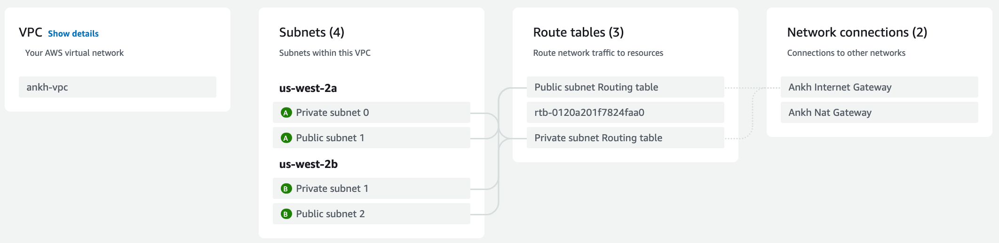

# Terraform

Some basic terraform examples.

## Setup

### OSX

If you don't have `brew` installed yet:

```bash
# Install Homebrew if not already using it
/bin/bash -c "$(curl -fsSL https://raw.githubusercontent.com/Homebrew/install/HEAD/install.sh)"

# Install terraform
brew tap hashicorp/tap
brew install terraform

# Install auto-completion
terraform -install-autocomplete
```

## Commands

In general you create a `main.tf` file, call `init` & `apply`. Done. Then `destroy` to remove everything again.

### [terraform init](https://developer.hashicorp.com/terraform/cli/commands/init)

"The terraform init command initializes a working directory containing Terraform configuration files. This is the first command that should be run after writing a new Terraform configuration or cloning an existing one from version control."

### [terraform plan](https://developer.hashicorp.com/terraform/cli/commands/plan)

"The terraform plan command creates an execution plan, which lets you preview the changes that Terraform plans to make to your infrastructure."

### [terraform fmt](https://developer.hashicorp.com/terraform/cli/commands/fmt)

"The terraform fmt command is used to rewrite Terraform configuration files to a canonical format and style. This command applies a subset of the Terraform language style conventions, along with other minor adjustments for readability."

### [terraform validate](https://developer.hashicorp.com/terraform/cli/commands/validate)

"The terraform validate command validates the configuration files in a directory, referring only to the configuration and not accessing any remote services such as remote state, provider APIs, etc."

### [terraform apply](https://developer.hashicorp.com/terraform/cli/commands/apply)

"The terraform apply command executes the actions proposed in a Terraform plan."

### [terraform destroy](https://developer.hashicorp.com/terraform/cli/commands/destroy)

"The terraform destroy command is a convenient way to destroy all remote objects managed by a particular Terraform configuration."

## Examples

You find the working configs in the [examples/](./examples) directory.

### 1. Docker with running NginX

Prerequisite: Install [Docker Desktop](https://docs.docker.com/desktop/install/mac-install/)

```bash
cd examples/nginx-with-docker

terraform init
terraform apply

# Check localhost:8000 for running nginx

terraform destroy
```

### 2. AWS t2-micro

Prerequisite: [Install AWS CLI](https://docs.aws.amazon.com/cli/latest/userguide/getting-started-install.html)

```bash
# Go to AWS IAM Dashboard and 'create access key', add key here:
aws configure

cd examples/aws-t2-micro

terraform init
terraform apply

# Check AWS account for running t2-micro (EC2 service)

terraform destroy
```

### 3. Local file and variables

How to create variables and local files, check out the example.

### 4. VPC

VPC with a private and public subnet, nat gateway & internet gateway

#### Result



## Troubleshoot

### Error on `source ~/.zshrc`

Verify `~/.zshrc` command for this entry:

```bash
autoload -Uz compinit && compinit # This line was missing
autoload -U +X bashcompinit && bashcompinit
complete -o nospace -C /opt/homebrew/bin/terraform terraform
```

### AWS refuses connection on port 53

My `/etc/resolv.conf` was missing, so I've linked it again:

```bash
# Requires root privilegues
ln -s /var/run/resolv.conf /etc/resolv.conf
```
